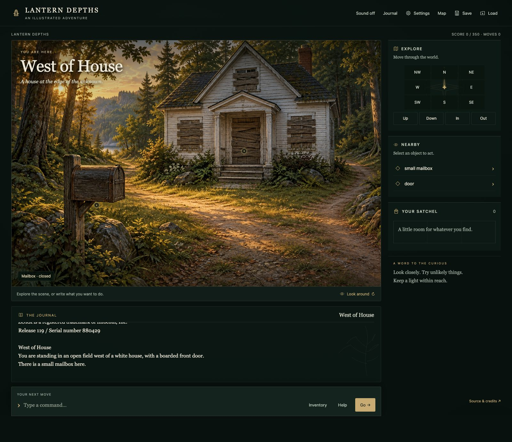
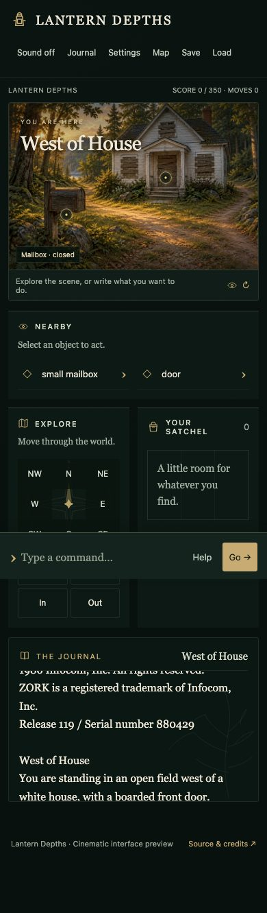

# Cinematic shell v1

Starting point: `ui/cinematic-shell-v1`, PR #1. Merged current main (v0.4.1)
so the full illustrated world, discovery map, details and supplied music survive.

## Design decisions

- Approximately 77% world / 23% interaction rail on large desktops, 1800px maximum shell.
- Original 3:2 artwork plane retained without cropping or distortion: sprite and
  hotspot positions remain registered to the paintings. Short desktop windows scroll;
  the parser is docked independently and remains reachable.
- Reduced gold framing and decorative cards; green-black surfaces, thin borders,
  readable ivory body text, brass accents and restrained original UI-kit vectors.
- Nearby lists only engine-visible objects. Selection is exposed with aria-pressed;
  marker labels reveal on hover, keyboard focus or selection. A door marker at the
  white house is an authored presentation anchor, filtered by existing visibility.
- Existing state-specific inventory art is reused in a visual satchel grid.
- Journal can fold independently of the parser. Its location heading comes from
  the VM, never parsed from prose. Original transcript content is unchanged.
- Help explains controls only and consumes no turn. Inventory sends the original
  `inventory` command; all eight compass directions and up/down/in/out remain.
- Mobile DOM and visual order: scene, interaction rail, journal. Parser stays docked,
  controls are touch-sized, settings remain inside the viewport. New game is in Settings.
- Keyboard object selection focuses available actions; action focus is restored
  after state updates. Reduced-motion support remains intact.

## Verification

`npm test`: 21 passed. `npm run test:browser`: 10 passed. `npm run build`: passed.
Includes the complete 350-point browser playthrough, mid-game save/reload, darkness,
house puzzles, troll-state engine tests, inventory targeting and music controls.
New checks cover desktop ratio, keyboard actions, focus marker labels, journal
folding, 1800px parser reachability, mobile order and settings containment.
The full-game end-state assertion now checks **all three** parser-bar buttons
are disabled, rather than assuming there is exactly one button.

Visual inspection: West of House, Living Room, Troll Room; desktop and mobile.
Layout measurements: 390, 900, 1440 and 1800px widths, no horizontal overflow.
No changes to engine.js, interactions.js, world-state.js, layers.js or room art.

